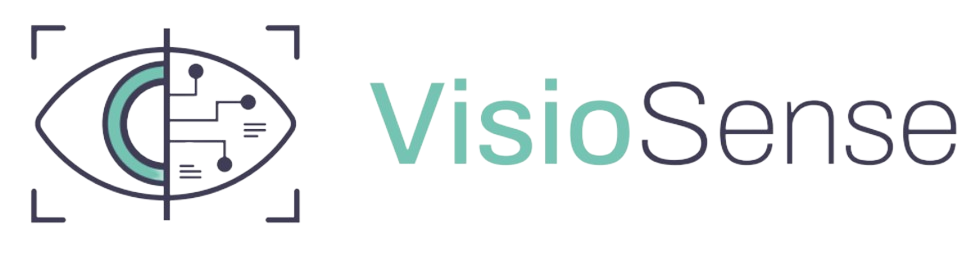
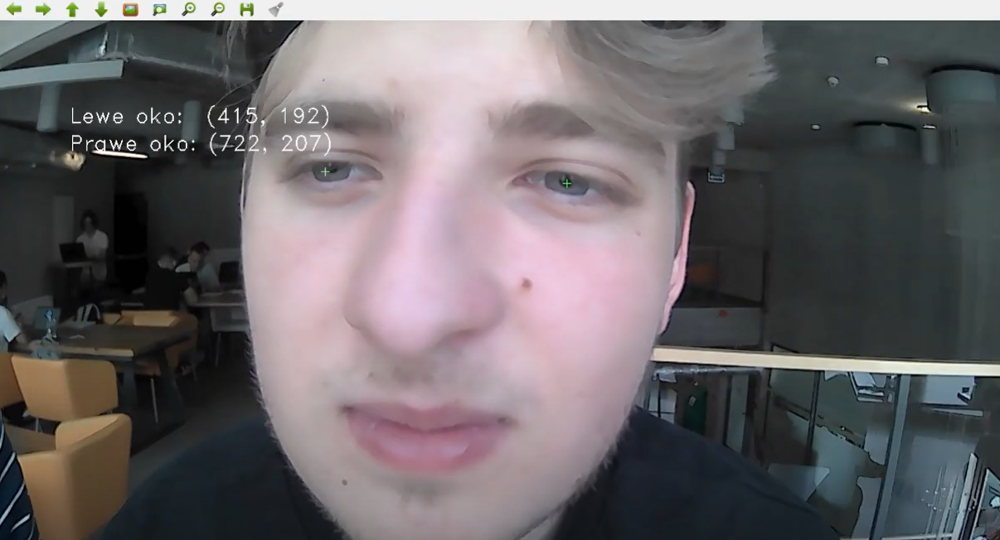
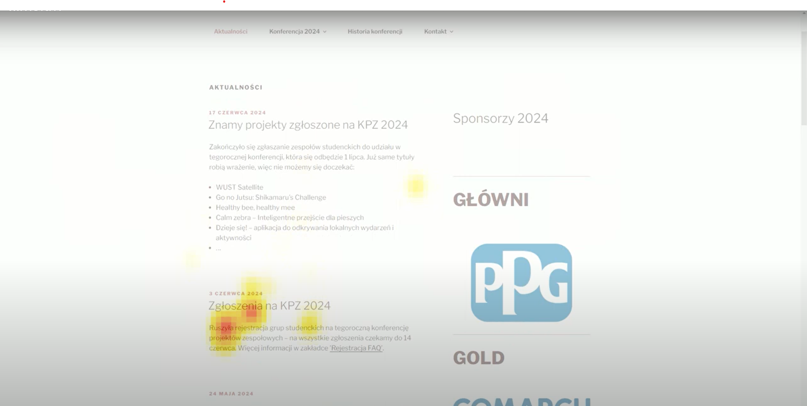
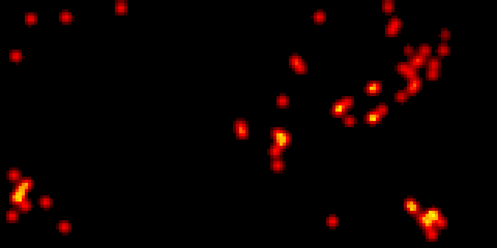
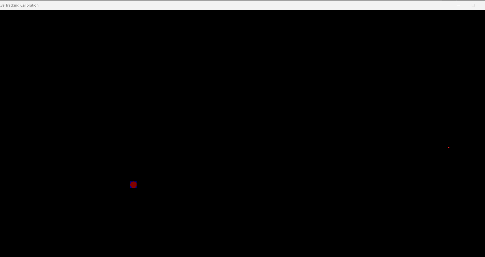

# Eyetracking by


## Tracking the eye
To test tracking the eye run:
````
python example.py
````



## Eyetracking with recording
To track the eye and record the screen with heatmap drawn onto it run:
````
python eyetracking.py
````



## Eyetracking heatmap
To run the program which shows you current heatmap:
````
python eyetracking_heatmap.py
````
It shows the point you're looking at, after a mouse click it generates a heatmap, and after closing the program, it saves the heatmap to a file.




## Eyetracking live
To run the program that shows you the position you're looking at over the current screen, run:
````
python eyetracking_live.py
````


## Specifiaction
Inside the programs, you need to change a few parameters. They are highlighted in the code by comments.

* Camera index `cv2.VideoCapture(index)`
* Screen size 
    * `SCREEN_WIDTH = 1600`
    * `SCREEN_HEIGHT = 800`
* Camera rotation `cv2.rotate(frame, cv2.ROTATE_180)`
* Path to file `cv2.VideoWriter('output.avi', fourcc, 2.0, (monitor['width'], monitor['height']))`